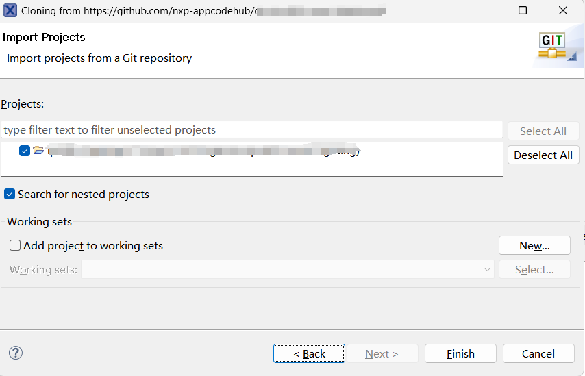
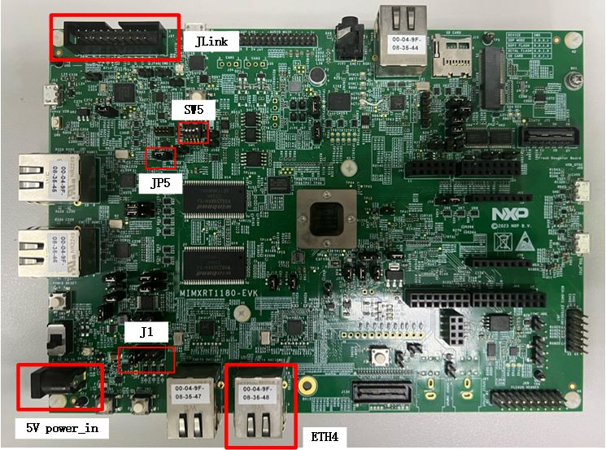
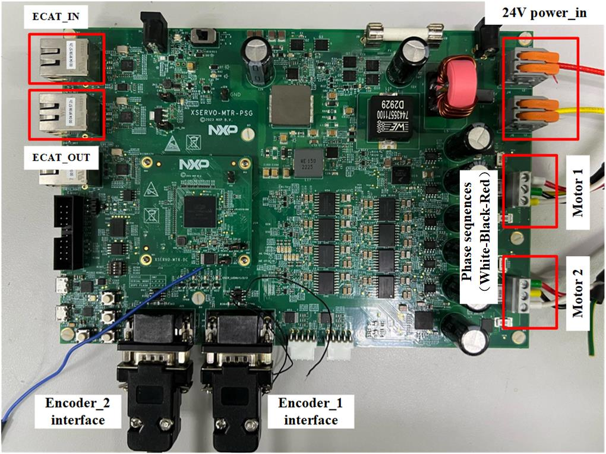
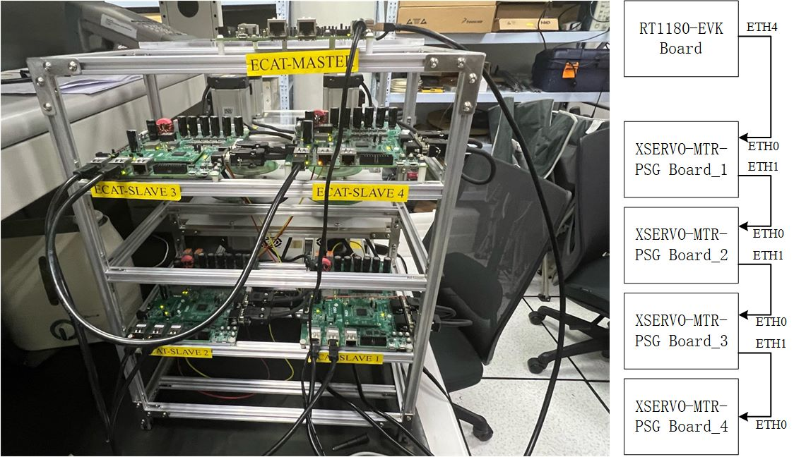
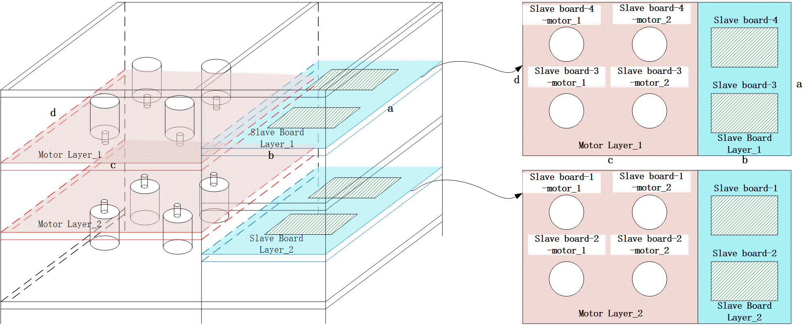
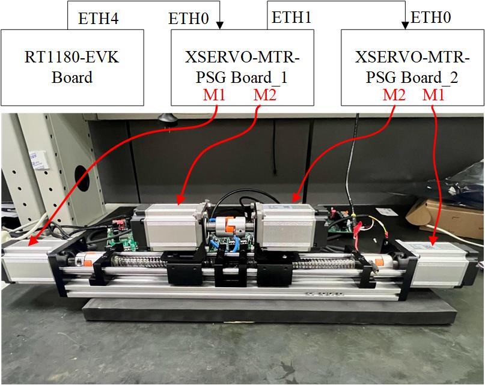

# NXP Application Code Hub
[](https://www.nxp.com)

## How to set up the motion control reference design on iMX.RT1180


This application demonstrates how to implement EtherCAT+  PMSM motor control on the iMX.RT1180. 
The reference design includes two projects, the master project and the slave project.The Master project is responsible for completing the processing of the EtherCAT master stack, and the Slave project is responsible for completing the processing of the EtherCAT slave stack and servo motor control.Based on this reference design, two demos were made for demonstration:
**Demo1:** 1 master with four slave nodes, each node controls two motors. Two motors from different slave nodes are grouped together, and the synchronization performance of EtherCAT is demonstrated through laser penetration and shielding.
**Demo2:** 1 master with two slave nodes, each node controls two motors.Motor 1 on different slave boards is responsible for controlling the left and right movement of the motor 2 platform. The two motors 2 on different boards will move synchronously when they are close to each other, and will move separately when they are separated.


#### Boards: XSERVO-MTR-DRV Board, MIMXRT1180-EVKC Board
#### Categories: Motor Control, Networking
#### Peripherals: ADC, PWM, ETHERNET
#### Toolchains: MCUXpresso IDE

## Table of Contents
1. [Software](#step1)
2. [Hardware](#step2)
3. [Setup](#step3)
4. [Results](#step4)
5. [Support](#step5)
6. [Release Notes](#step6)

## 1. Software<a name="step1"></a>
- [MCUXpresso IDE:11.8.1](https://www.nxp.com/design/design-center/software/development-software/mcuxpresso-software-and-tools-/mcuxpresso-integrated-development-environment-ide:MCUXpresso-IDE) 
- [SDK for EVK-MIMXRT1180: 2.16.0](https://mcuxpresso.nxp.com/en/builder?hw=MIMXRT1180-EVK) 
- Download the code from Git repository: TBD. 

## 2. Hardware<a name="step2"></a>
- Personal Computer
- NET Cable and 24V adaptor.
- XSERVO-MTR-DRV Board and [MIMXRT1180-EVK]()
- J-Link Debugger (v7.88e)

## 3. Setup<a name="step3"></a>

### 3.1 Step 1
1. Open MCUXpresso IDE, in the Quick Start Panel, choose **Import from Application Code Hub**

   
2. Enter the demo name in the search bar.

   
3. Click **Copy GitHub link**, MCUXpresso IDE will automatically retrieve project attributes, then click **Next>**.

   
4. Select **main** branch and then click **Next>**, Select the MCUXpresso project, click **Finish** button to complete import.

   
5. Click **Build** to start compiling the project.

   

### 3.2 Step 2
#### MIMXRT-1180-EVK RevC board set up

1. 5V supply via J2 (JP1 pin1 and pin2 are connected using a jumper).  

2. Connect J-Link Debugger to J37 of the MIMXRT-1180-EVK RevC board.

3. Import '[motion_control_master_soem]()'  project to MCUXpresso IDE.

4. Choose the SDP mode.(SW5->off-off-off-on).

5. Build motion_control_master_soem project（**Debug build**） and download the project to the board(JP5 need be connected with jumper).
**Note:** This project **CAN NOT** be built directly. CMSIS related files are missing in the project, users need to manually copy the files from (..\ [motion_control_servo_rt1180_cm33]()\CMSIS\..)  to (..\evkmimxrt1180_soem_servo_motor_bm_cm33\CMSIS\..).

6. Choose the Flashboot mode.(SW5->off-on-off-off).

7. Reset borad.D31 will be light up all the time.

8. Connect the ETH4 to the Slave network port using the network cable.

#### XSERVO-MTR-PSG RevA board set up

1. 5V supply via J16/17. 

2. Connect J-Link Debugger to J15 of the XSERVO-MTR-PSG RevA board.

3. Import ['motion_control_servo_rt1180_cm33' and 'motion_control_servo_rt1180_cm7']() project to MCUXpresso IDE.

4. Choose the SDP mode.(SW2->off-off-off-on).

5. Build 'motion_control_servo_rt1180_cm7' project first（**Release build**）.

6. Build 'motion_control_servo_rt1180_cm33'project（**Release build**）.Download the project to the board.
**Note:** This project **CAN NOT** be built directly. Please see the below.Details can be found in chapters 4 to 6.3 of the document in the path '\rd-motion-control-imxrt1180\motion_control_servo_rt1180_cm33\docs'.

##### Prepare the Demo
```
1. Generate the SSC source code
	- Download Slave Stack Code Tool(SSC Tool) from BECKHOFF official website and install it
	- Open Slave Stack Code Tool
	- Click 'File' -> 'New' -> 'Import' to import the Congfig file
		Select servo_motor.xml under path '.\boards\evkmimxrt1180\ecat_examples\servo_motor\<core>\SSC'.
	- Click 'Project' -> 'Create new Slave Files'
		'Source Folder'(default): '.\boards\evkmimxrt1180\ecat_examples\servo_motor\<core>\SSC\Src'.
		Click 'Start'.
	
2. Copy SSC souce code to '\rd-motion-control-imxrt1180\motion_control_servo_rt1180_cm33\ecat\SSC\Src', and change to '.\rd-motion-control-imxrt1180\motion_control_servo_rt1180_cm33\ecat\SSC' path to apply the patch.
	Linux:
		1. Download dos2unix command
			apt-get install dos2unix
		2. Transfer SSC source code format
			dos2unix Src/*
		3. Apply patch
			patch -d Src <  CiA402-combine-the-SSC-slave-with-ec_pmsm-support.patch
	Windows:
		1. Download patch.exe and Unix2Dos.exe tool
			Download Windows Patch Utility from http://gnuwin32.sourceforge.net/downlinks/patch-bin-zip.php .
			Download Dos2Unix/Unix2Dos-Text file format converters from https://sourceforge.net/projects/dos2unix/ .
		2. Transfer the patch format
			$(Dos2Unix/Unix2Dos-DIR)/bin/unix2dos.exe CiA402-combine-the-SSC-slave-with-ec_pmsm-support.patch
		3. Apply patch
			patch.exe -i CiA402-combine-the-SSC-slave-with-ec_pmsm-support.patch -d ./Src

3. Download the program to the Master board

4. Update ESI file to EEPROM
	- Copy ESI file 'ECAT-SERVO-MOTOR.xml' generated by SSC TOOL to <TwinCAT_installation_folder>/<Version>/Config/io/EtherCAT/
	- Restart TwinCAT3 IDE
	- Scan device and Update EEPROM
		
```

7. Choose the Flashboot mode.(SW2->off-on-off-off).

8. Reset borad.LED1 will light up every 1s.

9. Connect the power and encoder port of the motor1&2.

10. Connect the network cable, J3 is the input of slave and J7 is the output of slave.

### 3.2 Step 3
#### Demo1 set up
1. Network cable connection between master and slave.



2. 8 motors and 4 slave boards mounted to brackets.



3. Two 24V power supplies power the four boards. One power supply powers boards 1 and 2 /1 and 3, the other powers boards 3 and 4 /2 and 4

3. Make sure the motors are all in the correct position before powering up (is the laser able to pass through the round hole).

4. 24V power up for slave board.

5. 5V power up for master board.

#### Demo2 set up
1. Network cable connection between master and slave.



2. Install the four motors onto the slide and tighten the couplings.

3. Docking the M2 gears on both boards together as shown above.

4. 24V power up for slave board.

5. 5V power up for master board.


## 4. Results<a name="step4"></a>
Connect a USB cable between the host PC and the OpenSDA USB port on the Master board.Open a serial terminal with the following settings
	- 115200 baud rate
	- 8 data bits
 	- No parity
	- One stop bit
	- No flow control
The log below shows the output of this demo in the terminal window:
```
Init success!

Init 3 success!

Start SOEM SERVO MOTOR EXAMPLE!

NETC EP frame loopback example start.
Starting motion task
ec_init on netc0 succeeded.
ec_config_init 0
1 slaves found and configured.
ec_config_map_group IOmap:20001214 group:0
 >Slave 1, configadr 1001, state  2
  CoE Osize:192 Isize:192
     ISIZE:192 192 OSIZE:192
  SM programming
    SM2 Type:3 StartAddr:1100 Flags:   10064
    SM3 Type:4 StartAddr:1400 Flags:   10020
  OUTPUT MAPPING
    FMMU 0
      SM2
    slave 1 Outputs 20001214 startbit 0
 =Slave 1, INPUT MAPPING
    FMMU 1
      SM3
    Inputs 2000122C startbit 0
IOmapSize 48
Slaves mapped, state to SAFE_OP.
segments : 1 : 48 0 0 0
Request operational state for all slaves
Calculated workcounter 3
Request operational state for all slaves
Calculated workcounter 3
Operational state reached for all slaves.
```
#### Demo1 Result
[Demo1 Video](https://nxp1.sharepoint.com/teams/23_49/Shared%20Documents/Demo%20Videos/i.MX%20RT%20&%20DSC/RT1180Demo/Demo1.mp4)
#### Demo2 Result
[Demo2 Video](https://nxp1.sharepoint.com/teams/23_49/Shared%20Documents/Demo%20Videos/i.MX%20RT%20&%20DSC/RT1180Demo/Demo2.mp4)
## 5. Support<a name="step5"></a>
*Provide URLs for help here.*

#### Project Metadata

<!----- Boards ----->

<!----- Categories ----->
[](https://github.com/search?q=org%3Anxp-appcodehub+motor_control+in%3Areadme&type=Repositories)
[](https://github.com/search?q=org%3Anxp-appcodehub+networking+in%3Areadme&type=Repositories)

<!----- Peripherals ----->
[](https://github.com/search?q=org%3Anxp-appcodehub+adc+in%3Areadme&type=Repositories)
[](https://github.com/search?q=org%3Anxp-appcodehub+pwm+in%3Areadme&type=Repositories)
[](https://github.com/search?q=org%3Anxp-appcodehub+ethernet+in%3Areadme&type=Repositories)

<!----- Toolchains ----->
[](https://github.com/search?q=org%3Anxp-appcodehub+mcux+in%3Areadme&type=Repositories)

Questions regarding the content/correctness of this example can be entered as Issues within this GitHub repository.

>**Warning**: For more general technical questions regarding NXP Microcontrollers and the difference in expected functionality, enter your questions on the [NXP Community Forum](https://community.nxp.com/)

[](https://www.youtube.com/NXP_Semiconductors)
[](https://www.linkedin.com/company/nxp-semiconductors)
[](https://www.facebook.com/nxpsemi/)
[](https://x.com/NXP)

## 6. Release Notes<a name="step6"></a>
| Version | Description / Update                           | Date                        |
|:-------:|------------------------------------------------|----------------------------:|
| 1.0     | Initial release on Application Code Hub        | September 9<sup>th</sup> 2024 |

